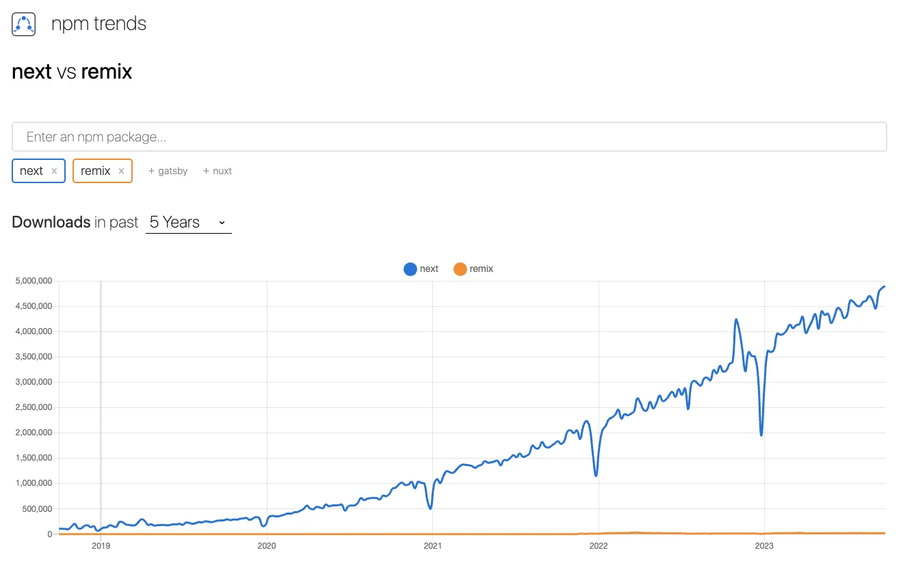

# Remix vs. Next.js

Date: `2024-03-08`

Status: `Proposed` | `In Progress`

## Context

Deciding between Remix and Next.js is a critical decision for our front-end architecture.

Both frameworks have their strengths and weaknesses, and choosing the right one will have a significant impact on our development process and the quality of our applications.

### Routing System

Next.js uses a *file based* routing system where each file in the "pages" directory corresponds to a route in the application.

Remix, on the other hand, uses a *route centric* approach, meaning routes are explicitly mentioned in the configuration file for the project, `remix.config.js`. The configuration maps the URLs to route modules.

The decision hinges on whether you value ease and simplicity or explicit organization and control when managing the routing in your web applications.

### Data Loading and Fetching

In `Next.js`, you can use a variety of techniques to fetch data, depending on your needs. For example, you can use:

- `getServerSideProps` to fetch data on the server and render it on the server. It is a good option for dynamic data that needs to be updated frequently.
- `getStaticProps` to fetch data on the server and render it statically. It is a good option for static data that doesn't change often.
- `getInitialProps` to fetch data on the server and pass it to the client. It is a good option for data that needs to be fetched on the server but can be updated on the client.

Client-side data fetching in `Next.js` is typically done with standard React `useEffect` or `fetch` calls.

In Remix, the concept of loaders is used to fetch data for a route. These can be defined for both server-side and client-side data fetching. This approach provides a unified way to manage data loading across our application.

For someone new to both frameworks, learning three different data fetching methods in Next.js is a steeper learning curve compared to learning the single loader concept in Remix.

The other thing to consider is since data fetching methods in Next.js are placed alongside the page components, this can lead to large files if the data fetching logic is complex.

Remix encourages placing loaders in a separate file or alongside the route module, which can lead to better organization, especially in applications with complex data fetching logic.

### Performance Optimization

While both frameworks are engineered for high performance, Remix offers better dynamic content delivery, faster build times, and a more straightforward approach to handling data. On the other hand, if your project has a strong emphasis on delivering static content efficiently, and you're already familiar with Next.js, there's no reason to move away from it.

Remix's edge is in serving dynamic content. It's designed to deliver fast user experiences even on slow networks, automatically handling errors, interruptions, and race conditions which Next.js doesn't handle out of the box.

Next.js encourages the use of client-side JavaScript for serving dynamic content and requires it for data mutations.

On the contrary, Remix doesn't rely on client-side JavaScript for these tasks, leading to faster interactions and less data over-fetching.

As projects scale, Next.js build times increase linearly with your data, which could slow down the development process.
Remix, though, boasts nearly instant build times that are decoupled from data, making it a more scalable choice for larger projects.

### Community and Ecosystem

Next.js is a well-established framework with a larger community and ecosystem than Remix, a significant advantage when looking for solutions to problems, plugins, or integrations.

That said, Remix was clearly designed to improve developer productivity with its route-centric development and fine-grained control over data loading and navigation. It provides a performance edge especially in applications with complex data requirements.

> Next.js is more popular than Remix, but Remix is a compelling choice for teams looking to deliver fast user experiences and handle data efficiently.

For a project that serves a vast amount of static content like an e-commerce site’s product pages, category pages, and blog posts, Next.js would be a wise choice due to its strong support for static site generation and many integrations.

However, if you’re building something like a real-time dashboard that must handle dynamic data efficiently, provide fast user experiences even on slow networks, and allow for flexible routing to manage the complex navigation requirements of the dashboard, Remix would be a more fitting choice.

The route-centric development and unified data fetching method provided by Remix would allow for complex routing scenarios and efficient handling of dynamic data.

In the end, both frameworks are robust and capable, and your choice will ultimately depend on your project's long-term vision and the development experience you seek to achieve.

## Decision

We have decided to use Remix as our primary front-end framework for new projects going forward.

- Remix is as fast or faster than Next.js at serving static content.
- Remix is faster than Next.js at serving dynamic content
- Remix enables fast user experiences even on slow networks
- Remix automatically handles errors, interruptions, and race conditions, Next.js doesn't
- Next.js encourages client side JavaScript for serving dynamic content, Remix doesn't
- Next.js requires client side JavaScript for data mutations, Remix doesn't
- Next.js build times increase linearly with your data, Remix build times are nearly instant and decoupled from data
- Next.js requires you to change your application architecture and sacrifice performance when your data scales
- We think Remix's abstractions lead to better application code

## Consequences

- Developers will need to learn Remix's route-centric development model and unified data fetching methods.
- Developers will need to set up a Remix build pipeline for their projects.
- Developers will need to use Remix-specific tools and libraries.
- Developers will need to write loaders for data fetching in Remix.
- Developers will need to adapt to Remix's abstractions and conventions.

## References

- [Next.js by Vercel - The React Framework (nextjs.org)](https://nextjs.org/)
- [Remix - Build Better Websites](https://remix.run/)
- [Remix vs Next.js | Remix](https://remix.run/blog/remix-vs-next)
- [Next.js or Remix: Which Framework is Better, and When? | Rollbar](https://rollbar.com/blog/nextjs-vs-remix/)
- [Next.js 13 vs Remix: An In-depth case study (prateeksurana.me)](https://prateeksurana.me/blog/nextjs-13-vs-remix-an-in-depth-case-study/)
- [Remix Takes on Next.js in Battle of the React Frameworks - The New Stack](https://thenewstack.io/remix-takes-on-next-js-in-battle-of-the-react-frameworks/)
